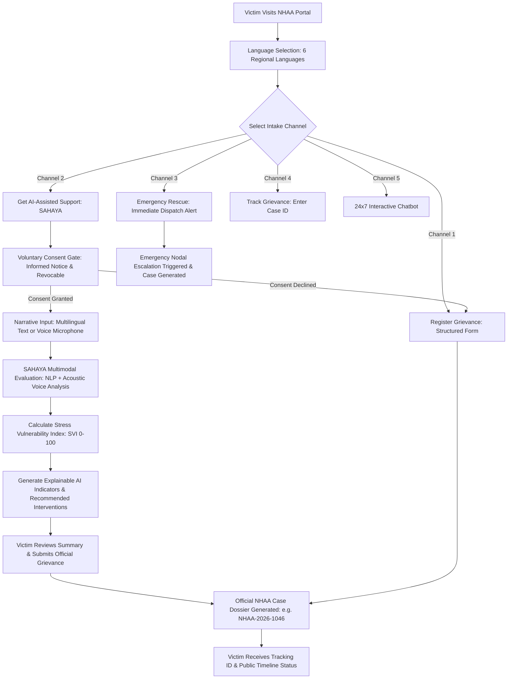
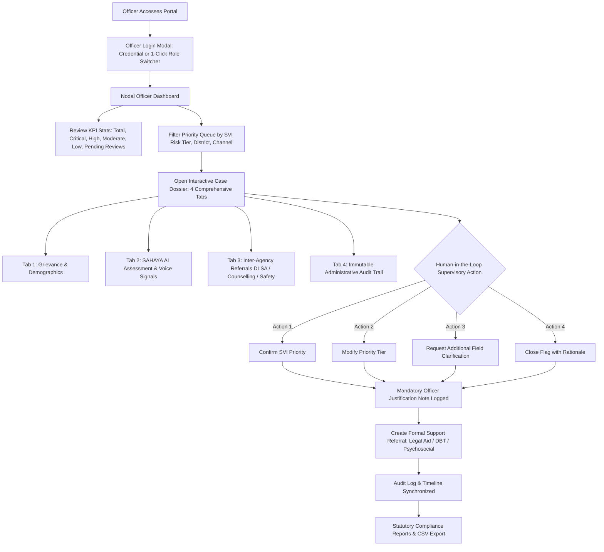

# NHAA + SAHAYA Platform
### AI-Assisted Victim Vulnerability, Trauma Assessment & Redressal Platform

[](https://nhaa-snowy.vercel.app)
[](https://github.com/rkdivyashree04/NHAA)
[](https://vite.dev)
[](https://react.dev)

An integrated, victim-centred public service platform combining the **National Helpline Against Atrocities (NHAA - 14566)** with **SAHAYA**, an AI-assisted victim vulnerability, trauma assessment, and human-in-the-loop prioritization module.

Operating under the statutory mandate of:
- **The Scheduled Castes and the Scheduled Tribes (Prevention of Atrocities) Act, 1989**
- **The Protection of Civil Rights Act, 1955**
- *Department of Social Justice & Empowerment, Ministry of Social Justice & Empowerment, Government of India*

---

## 🌐 Live Deployment
- **Production URL:** [https://nhaa-snowy.vercel.app](https://nhaa-snowy.vercel.app)
- **Primary Helpline:** Toll-Free `14566` (24x7 Operations)

---

## 🛠️ Complete Technology Stack

| Layer | Technologies & Libraries | Key Highlights |
| :--- | :--- | :--- |
| **Core Framework** | **React 19.2** | Modern component-driven SPA, Context API state management (`AuthContext`, `CaseContext`, `LanguageContext`, `ThemeContext`). |
| **Build Tool & Bundler** | **Vite 8.3** (with Rolldown engine) | Lightning-fast HMR, production code splitting into optimized chunks (`react-vendor`, `chart-vendor`, `lucide-vendor`). |
| **Styling & Design System** | **Vanilla Semantic CSS3** | Custom design tokens, glassmorphism, responsive Flexbox/Grid layouts, dual theme support (Government Light default & Dark Mode). |
| **Data Visualization** | **Chart.js 4.5** + **react-chartjs-2** | Responsive Doughnut triage distributions, Monthly District Caseload Bar charts, SVI Escalation Trends. |
| **Iconography** | **Lucide React** (v1.48) | Accessible, lightweight SVG iconography for emergency actions, statutory pillars, and nodal tools. |
| **NLP & SVI Engine** | Custom JavaScript NLP Module (`sahayaEngine.js`) | Multi-tier linguistic indicator classification (Threat, Fear, Trauma, Isolation, Safety), SVI (0–100) scoring, Explainable AI (XAI) points. |
| **Voice & Acoustic Signals** | **Web Speech API** + **Web Audio API** | Multilingual speech-to-text recognition, live audio waveform visualizer, pause duration, speech rate, pitch variance metrics (`speechService.js`). |
| **Internationalization (i18n)** | Custom Multilingual Context (`LanguageContext.jsx`) | Full localization across **6 regional languages**: English (`en`), Tamil (`ta`), Hindi (`hi`), Telugu (`te`), Kannada (`kn`), Malayalam (`ml`). |
| **Data Persistence** | Browser `localStorage` Engine | Offline-first, reliable client storage for cases, statutory timelines, referrals, notifications, and immutable audit logs. |
| **Hosting & CI/CD** | **Vercel** + **Git** | Automated continuous deployment from GitHub `main` branch, Edge CDN caching, SPA rewrite fallback routing (`vercel.json`, `_redirects`). |

---

## 🔄 User Flow (Victim / Public Citizen)

The citizen workflow is designed with trauma-informed UX principles, accessibility safeguards, and voluntary consent gates.



### Detailed Steps:
1. **Landing & Regional Language Switch**: The victim arrives at the portal and chooses their preferred language (English, தமிழ், हिन्दी, తెలుగు, ಕನ್ನಡ, മലയാളம்). Toll-free 14566 helpline is prominently displayed.
2. **Channel Selection**:
   - **Register Grievance**: Traditional statutory grievance form under the SC/ST (PoA) Act.
   - **SAHAYA Module**: Victim-centred trauma and vulnerability assessment.
   - **Emergency Rescue**: One-click acute danger escalation dispatched to District Magistrate/SP.
   - **Track Grievance**: Real-time progress tracker via Case ID or Reference number.
   - **Chatbot**: Step-by-step guidance on statutory rights, entitlements, and filing.
3. **Voluntary Consent Gate**: Clear statutory disclaimer stating that SAHAYA is an administrative triage aid (non-clinical/non-diagnostic) and requires explicit victim permission.
4. **Multimodal Input (Text + Speech)**: Victims can type in their language or use microphone input. Web Speech API transcribes speech while Web Audio API captures acoustic distress signals (speech rhythm, pauses, tremors).
5. **Instant SVI & XAI Feedback**: Computes Stress Vulnerability Index (0–100), presents clear explainability bullets, and suggests support avenues (Legal Aid, Trauma Counselling, Protection).
6. **Case Filing & Public Tracking**: A formal Case ID (`NHAA-2026-XXXX`) is issued. The victim tracks updates through an outward-facing sanitized timeline without exposing sensitive internal intelligence.

---

## 🛡️ Officer Flow (Nodal Officer / Legal Counsel / Counsellor / Admin)

The administrative workflow enforces statutory accountability through human-in-the-loop oversight and inter-agency coordination.



### Detailed Steps:
1. **Authentication & Multi-Role Access**: Designated officers sign in via official credentials or quick-switch across 4 pre-configured demo roles:
   - **Nodal Case Officer** (`selvam.nodal`): District administration & PoA triage.
   - **Trauma Counsellor** (`ananya.counsel`): Mental health & psychosocial rehabilitation.
   - **Special Legal Counsel** (`prakash.legal`): Free legal aid, DLSA advocacy, FIR assistance.
   - **Platform Administrator** (`admin.nhaa`): System oversight, audit logs, SVI calibrations.
2. **Executive Triage Dashboard**: View real-time alert banners for `CRITICAL` and `HIGH` danger cases, active emergency dispatches, and key district metrics.
3. **Queue Sorting & Filtering**: Sort grievances by SVI score, time elapsed, geographic jurisdiction, or status.
4. **4-Tab Case Dossier Inspection**:
   - **Victim Particulars**: Identity, demographics, preferred communication channel, incident details.
   - **SAHAYA Assessment**: Numerical SVI breakdown, fear/threat sub-indices, acoustic metrics, explainable AI reasoning.
   - **Inter-Agency Referrals**: Track DLSA legal aid, medical care, witness protection, and DBT grant status.
   - **Audit Timeline**: Timestamped internal history recording every system and officer action.
5. **Human-in-the-Loop Decision**: The officer evaluates the AI priority recommendations and enters a signed supervisory action (`Confirm Priority`, `Modify Priority`, `Request More Info`, or `Close Flag`) with mandatory notes.
6. **Referral Dispatch**: Officers initiate referrals directly to district legal services, psychological counsellors, or police protection cells.
7. **Statutory Reporting**: Generate and export formal compliance dossiers and CSV reports formatted for District Collectorates and Central SC/ST Commissions.

---

## 👥 Demo Officer Credentials

| Role | Name & Designation | Username | Password | District / State |
| :--- | :--- | :--- | :--- | :--- |
| **Nodal Case Officer** | Dr. R. Selvam, IAS | `selvam.nodal` | `officer@123` | Salem / Tamil Nadu |
| **Crisis Counsellor** | Smt. Ananya Sharma | `ananya.counsel` | `counsel@123` | Lucknow / Uttar Pradesh |
| **Special Legal Counsel** | Adv. Prakash Rao | `prakash.legal` | `legal@123` | Bengaluru Urban / Karnataka |
| **Administrator** | Vikramaditya Singh | `admin.nhaa` | `admin@123` | New Delhi / Delhi (NCT) |

*(All roles feature **1-Click Instant Login** inside the Officer Login modal).*

---

## 🚀 Local Development Setup

### Prerequisites
- Node.js (v18.0 or higher)
- npm (v9.0 or higher)

### Run Locally
```powershell
# Clone the repository
git clone https://github.com/rkdivyashree04/NHAA.git
cd NHAA

# Install dependencies
npm install

# Start development server
npm run dev

# Build for production
npm run build

# Preview production build locally
npm run preview
```

---

## ⚖️ Legal & Administrative Disclaimer
*SAHAYA Stress Vulnerability Index (SVI) thresholds, acoustic speech cues, and linguistic indicators shown in this platform are administrative demonstration tools engineered strictly to assist authorized officers in case triaging and prioritization. SAHAYA does not deliver clinical psychiatric diagnoses, nor does it replace judicial, investigative, or police decision-making under the Code of Criminal Procedure / Bharatiya Nagarik Suraksha Sanhita.*

---

© 2026 National Helpline Against Atrocities (NHAA) & SAHAYA Platform. Department of Social Justice & Empowerment, Government of India.
